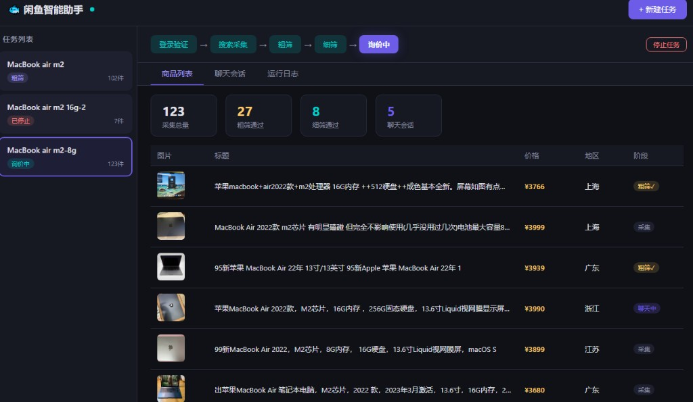
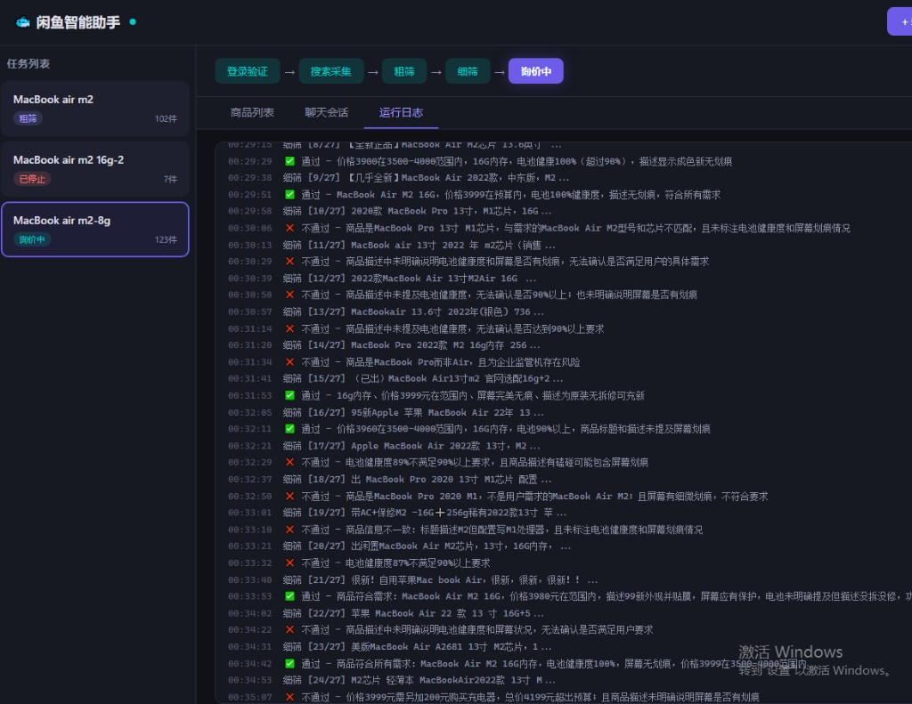
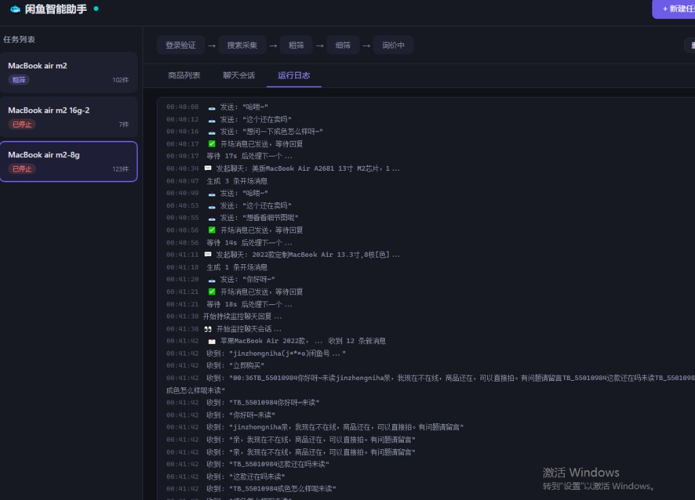
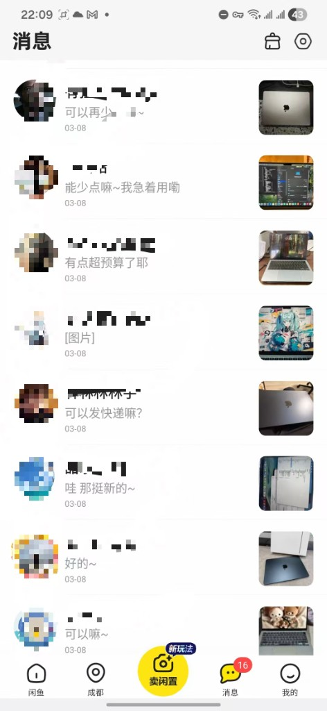
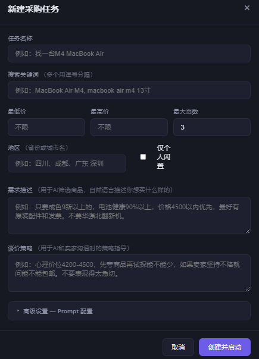
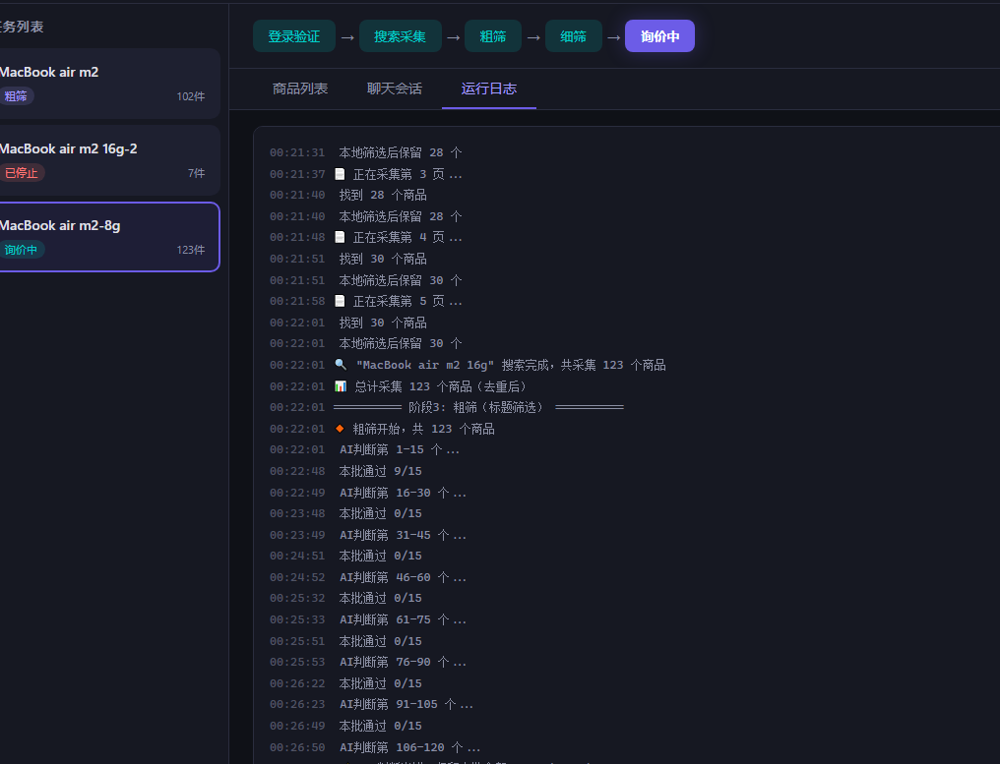

<div align="center">

# 🐟 闲鱼扫货助手

**告别手动翻页、逐个砍价的低效扫货方式**

AI 帮你搜、帮你筛、帮你聊 —— 你只需要告诉它"你想买什么"

[](https://nodejs.org/)
[](https://playwright.dev/)
[](LICENSE)

</div>

---

## 痛点

在闲鱼买一台二手 MacBook，你会遇到这些问题：

**搜索结果质量差** — 搜"MacBook Air M2 16G"，出来一堆手机壳、贴膜、维修服务、求购帖。参数越长尾、越具体，搜索结果里的噪声越多，翻5页才能挑出几个靠谱的。

**标题党泛滥** — 标题写着"99新 无划痕"，点进详情页一看："轻微磕碰、电池健康82%、屏幕有一条细划痕"。不打开详情页，光看标题根本判断不了真实情况。

**平台筛选形同虚设** — 闲鱼的"几成新"完全靠卖家自己勾，8成新和99新混在一起。想知道真实成色？只能一个个点进去看图和描述。

**砍价是体力活** — 好不容易筛出几个，还得一个个打招呼、问成色、问电池、问能不能包邮、试探底价……十几个卖家，每个都重复同样的对话流程。

> **一个下午过去了，你只聊了3个卖家，还没一个谈拢。**

这个工具就是来解决这个问题的 —— **让 AI 帮你海量扫、逐个筛、自动聊。**

---

## 看看实际效果

### 一个任务搜 123 件商品，AI 自动筛到 8 件，同时跟 5 个卖家聊



### AI 逐个打开详情页，像老买家一样判断每件商品

> "电池健康87%不满足90%以上要求" / "价格3999在范围内，屏幕完美无划痕" / "商品是MacBook Pro不是Air，不符合需求"



### 自动跟卖家聊天、询价、砍价 —— 全程日志可追踪



### 手机上打开闲鱼：已经聊开了

<div align="center">
&nbsp;&nbsp;&nbsp;&nbsp;
</div>

<br>

> 上面是真实运行结果。一个任务下来，十几个卖家已经在跟"你"热聊了 —— "可以再少点嘛"、"好的~"、"电池健康多少呀"、"能少点嘛~我急着用嘞"…… 卖家完全以为在跟真人说话。

---

## 为什么卖家愿意聊？—— 因为有「人设」

这不是那种发一句"最低多少"就完事的脚本。

**内置的 AI 人设是一个高情商女大学生买家**，说话有温度、有策略、有节奏：

- 开场先夸商品、拉近距离："哇这个成色好好呀~还在吗"
- 中场自然地了解信息："电池健康怎么样呢~有没有磕碰呀"
- 砍价时卖萌示弱而不是冷冰冰丢数字："有点超预算了耶🥺 能再少一丢丢嘛~"
- 每条消息控制在 15 字以内，像真人一样分条发送
- 语气词、表情、波浪号自然穿插，不会被识别为机器人

**卖家的真实反应**（来自上面的截图）：
- "好的~"、"哇 那挺新的~"、"可以嘛~" —— 卖家在配合聊天
- "可以发快递麻~"、"算了 妹妹 m4的得在现场" —— 卖家在主动推进交易
- "底价了"、"实价了~" —— 砍价流程自然推进到底价

**人设完全可自定义**：换成男大学生、数码发烧友、精打细算的宝妈……任何你想要的沟通风格，在新建任务时直接改就行。

---

## 省钱设计 & 聊天记忆

### 💰 两轮筛选，极致省 Token

不是每件商品都调用大模型。两轮筛选的设计大幅减少 API 消耗：

| 阶段 | 做什么 | API 调用量 |
|------|--------|-----------|
| **粗筛** | 只看标题，15个一批送给AI判断 | 123件商品 ≈ 9次调用 |
| **细筛** | 只有粗筛通过的才打开详情页深度判断 | 27件通过 = 27次调用 |
| **聊天** | 只有细筛通过的才发起聊天 | 8件通过 = 8个会话 |

> 123 件商品，全流程下来大约 **40+ 次 API 调用**，用 DeepSeek V3 大约 ¥0.05 ~ ¥0.3。如果全部都做细筛再聊天，费用要翻 10 倍。

### 🧠 聊天会话记忆

- 每个卖家的完整对话历史都保存在本地
- **任务中断后重启，自动从上次位置继续聊**，不会重复发消息、不会丢上下文
- 等待卖家回复期间零消耗，有新消息才触发 AI 生成回复
- 自动判断目标是否达成（谈妥/被拒/商品下架），不在死单上浪费时间

---

## 全部可自定义



不只是填关键词这么简单。每个任务都可以精细配置：

**搜索条件**
- 多关键词（逗号分隔）
- 价格区间、地区、仅个人闲置

**AI 筛选规则**
- 用自然语言描述你的需求
- 粗筛 / 细筛 Prompt 都可以自定义

**砍价策略**
- 心理价位、砍价节奏、底线
- "先夸再砍"还是"直接报价"

**聊天人设**
- 默认高情商女大学生
- 可改为任何风格

<br clear="right">

---

## 它能做什么？

> "我想买一台 MacBook Air M2，成色9新以上，电池健康90%+，预算4000以内"

你只需要像这样描述需求，然后：

| 步骤 | 做什么 | 谁来做 |
|:---:|--------|:---:|
| 1 | 在闲鱼搜索多个关键词，自动翻页采集商品 | 🤖 |
| 2 | 根据标题批量粗筛，排除明显不相关的 | 🤖 |
| 3 | 逐个打开详情页，深度判断是否符合需求 | 🤖 |
| 4 | 用高情商人设跟卖家聊天、询价、砍价 | 🤖 |
| 5 | 看看结果，挑一个满意的下单 | **你** |

整个过程你可以在实时看板上全程围观。

## 30 秒上手

```bash
git clone https://github.com/Disrush/xianyu-shopping-assistant.git
cd xianyu-shopping-assistant
npm install
npx playwright install chromium
npm start
```

打开 http://localhost:3000 → 点「设置」配置 API Key → 点「新建任务」开始扫货

> **Windows 用户** 更简单：双击 `start.bat`，全自动安装启动

## 支持的 AI 服务商

开箱预设了 **8 大主流服务商**，也可以填任何 OpenAI 兼容的自定义端点：

| 服务商 | 推荐模型 | 说明 |
|--------|---------|------|
| **DeepSeek** | DeepSeek V3 | 性价比之王，中文能力强 |
| **OpenRouter** | 自选 | 聚合平台，一个 Key 用几百个模型 |
| **OpenAI** | GPT-4o Mini | 经典选择 |
| **通义千问** | Qwen Plus | 阿里出品，国内直连快 |
| **SiliconFlow** | DeepSeek V3 | 硅基流动，国内平台免翻墙 |
| **智谱 AI** | GLM-4 Flash | 免费额度多 |
| **Moonshot** | Kimi 128K | 长上下文 |
| **Groq** | Llama 3.3 70B | 推理最快 |
| **自定义** | 任意 | 填入你自己的 Base URL |

> 💡 **推荐**：用 DeepSeek V3 或 GPT-4o Mini，性价比最高。

## 更多截图

<details>
<summary><b>搜索采集 & 粗筛日志</b></summary>
<br>



5页搜索采集 123 个商品 → AI 标题粗筛只保留 27 个相关的

</details>

<details>
<summary><b>细筛日志 —— AI 逐个分析给理由</b></summary>
<br>


每个商品都有明确的通过/不通过理由，比人工筛选更一致

</details>

<details>
<summary><b>自动聊天日志</b></summary>
<br>


逐个发起聊天 → 发送开场白 → 等待回复 → 持续监控跟进

</details>

## 项目结构

```
├── server.mjs           # Express + WebSocket 主服务
├── start.bat            # Windows 一键启动
├── public/
│   ├── index.html       # 看板界面
│   ├── app.js           # 前端逻辑（任务管理、配置、实时更新）
│   └── style.css        # 暗色主题样式
├── lib/
│   ├── config.mjs       # API 配置管理（多供应商支持）
│   ├── ai.mjs           # LLM 调用、Prompt 工程
│   ├── task.mjs         # 任务流水线编排
│   ├── search.mjs       # 闲鱼搜索与商品采集
│   ├── filter.mjs       # AI 粗筛 / 细筛
│   ├── chat.mjs         # 自动聊天引擎
│   ├── login.mjs        # 登录状态检测
│   ├── browser.mjs      # Playwright 浏览器管理
│   └── utils.mjs        # 工具函数
└── data/                # 运行时数据（gitignore）
```

## 常见问题

<details>
<summary><b>首次运行要登录吗？</b></summary>
是的。首次启动时会弹出 Chromium 浏览器，你需要在闲鱼网页端手动登录一次。之后登录状态会自动保持。
</details>

<details>
<summary><b>遇到滑块验证怎么办？</b></summary>
在弹出的浏览器窗口中手动完成验证即可，系统会自动检测并等待你完成，之后继续执行。
</details>

<details>
<summary><b>任务中断了数据会丢吗？</b></summary>
不会。所有进度实时保存，重新启动任务会从上次中断的阶段恢复。聊天会话的完整上下文也会保留，续聊时不会重复发消息。
</details>

<details>
<summary><b>API Key 安全吗？</b></summary>
API Key 仅保存在你本地的 <code>data/config.json</code> 中，该文件已加入 .gitignore，不会被提交或上传。
</details>

<details>
<summary><b>一次任务大概花多少 API 费用？</b></summary>
取决于商品数量和聊天轮次。典型场景（搜3页、筛选50个、聊天5个卖家）大约消耗 ¥0.05 ~ ¥0.3，两轮筛选设计把调用量压到了最低。
</details>

<details>
<summary><b>会不会被闲鱼封号？</b></summary>
本工具使用真实浏览器（非接口调用），消息频率有随机延迟控制，模拟真人操作。但任何自动化工具都有风险，建议不要在主力账号上高频使用。
</details>

## 环境要求

- **Node.js** v18+（[下载](https://nodejs.org/)）
- **操作系统** Windows / macOS / Linux
- **网络** 能访问闲鱼(goofish.com) + 你选择的 AI 服务商

## License

MIT — 随便用，觉得有用给个 Star ⭐
